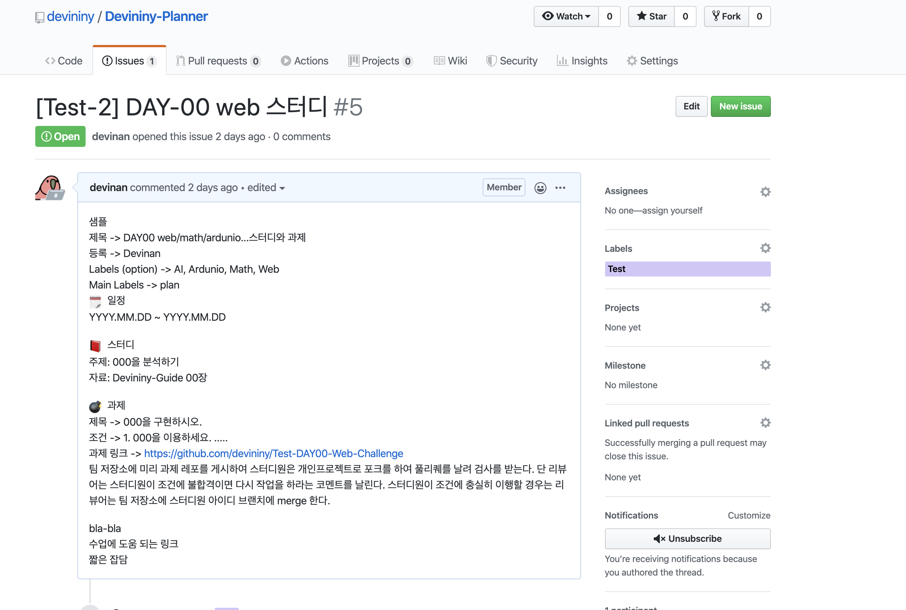
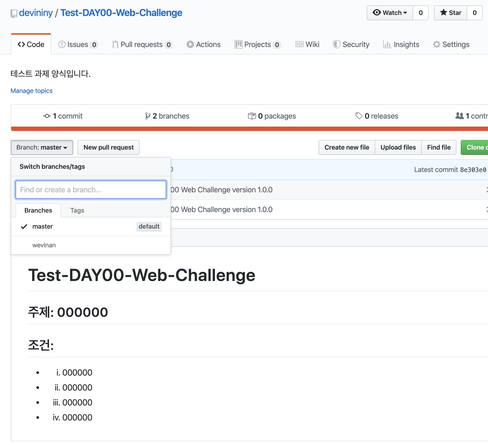
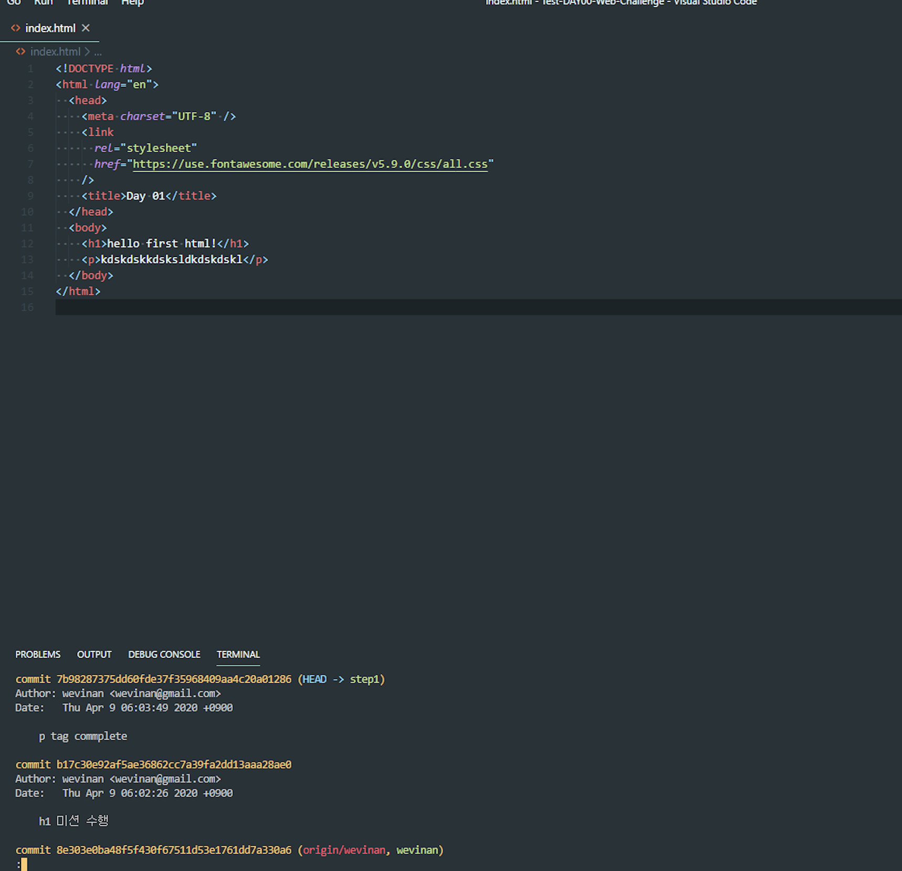
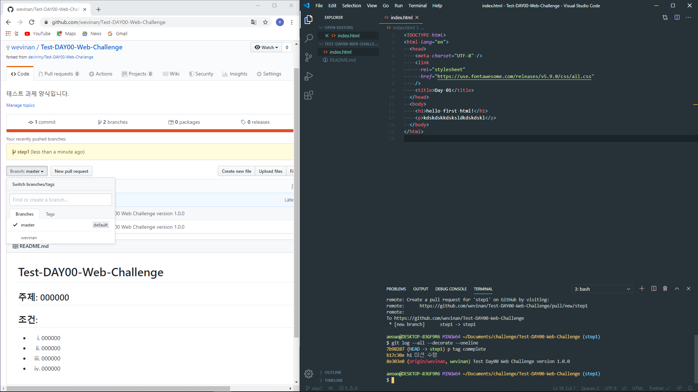

## Step 1. 미션을 시작하고 개인의 깃허브의 올리는 단계까지의 과정을 다룬다.

---

1. Devininy-Planner에서 과제를 확인한다.

- Devininy-Planner([camp](https://github.com/devininy/Devininy-Planner)) 또는 슬랙의 planner 채널에 접속해 **과제 링크**를 눌러서 확인한다.



- **과제 링크**를 클릭하면 과제 저장소로 이동한다.



- 스터디원은 자신의 계정 브런치가 있는 것을 확인 하셔야 합니다.

---

2. 과제 프로젝트를 자신의 저장소로 포크를 해야합니다. 우측 상단의 버튼인 fork를 누르시면 됩니다.
   > Devininy 저장소는 권한이 없습니다. 새로 미션을 추가하는 코드를 만들수 없습니다.
   >
   > fork는 팀의 저장소를 자신의 계정으로 복사하는 기능입니다. 앞으로 모든 과제는 자신의 계정 아래에 있는 저장소를 활용하셔서 진행하셔야 합니다.

---

3. fork한 저장소를 자신의 컴퓨터로 clone한 후 과제를 진행하실수 있습니다.
   > 포크한 저장소는 개인의 저장소에서 바로 작업이 가능합니다.
   >
   > clone 명령은 github.com에 존재하는 저장소를 자신의 노트북 또는 PC로 복사하는 과정입니다.

- 터미널에서 다음 명령을 입력한다.

```
git clone -b {본인_아이디} --single-branch https://github.com/{본인_아이디}/{저장소 아이디}
ex) git clone -b wevinan --single-branch https://github.com/wevinan/Test-DAY00-Web-Challenge
```

```
// clone한 폴더로 이동하는 방법
cd {저장소 아이디}
ex) cd Test-DAY00-Web-Challenge
```

---

4. 기능 구현을 위한 브랜치 생성

   > git은 서로 다른 작업을 하기 위한 별도의 공간을 생성할 때 브랜치를 생성할 수 있다.
   >
   > 브랜치를 생성하는 이유는 실무에서 프로젝트를 진행할 때와 같은 방법으로 기능을 구현하고, 리뷰하는 경험을 전달하기 위함이다.

- 4-1. 과제의 README 내용이 Step 1 만 언급하였을때는 step 1 브랜치를 생성하지 말고 자신의 아이디 계정 브런치에서 작업을 한다.

- 4-2. 과제의 README 내용이 Step 2,3... 이 언급 되었을 경우는 아래의 설명을 따른다.

- 터미널에서 다음 명령을 입력해 브랜치를 생성한다.

```
git checkout -b 브랜치이름
ex) git checkout -b step1
```

---

5. 기능 구현

   > 과제의 설명에 따라 Step1 브랜치에서 진행한다.

6. 기능 구현 후 add, commit
   > 기능 구현을 완료한 후 로컬 저장소에 변경된 부분을 반영하기 위해 add, commit 명령을 사용한다.

```
git status // 변경된 파일 확인
git add -A(또는 .) // 변경된 전체 파일을 한번에 반영
git commit -m "메시지" // 작업한 내용을 메시지에 기록
```

- 기능 구현을 완료하고 add, commit 명령을 실행한 후의 상태는 다음과 같다.



---

7. 본인 원격 저장소에 올리기
   > 로컬에서 commit 명령을 실행하면 로컬 저장소에만 반영되고, 원격 github.com의 저장소에는 반영되지 않는다.

```
git push origin 브랜치이름
ex) git push origin step1
```

- push 명령을 실행한 후의 상태는 다음과 같다.



## 1단계를 모두 완료하면 [2단계](./2.md) 를 진행한다.
