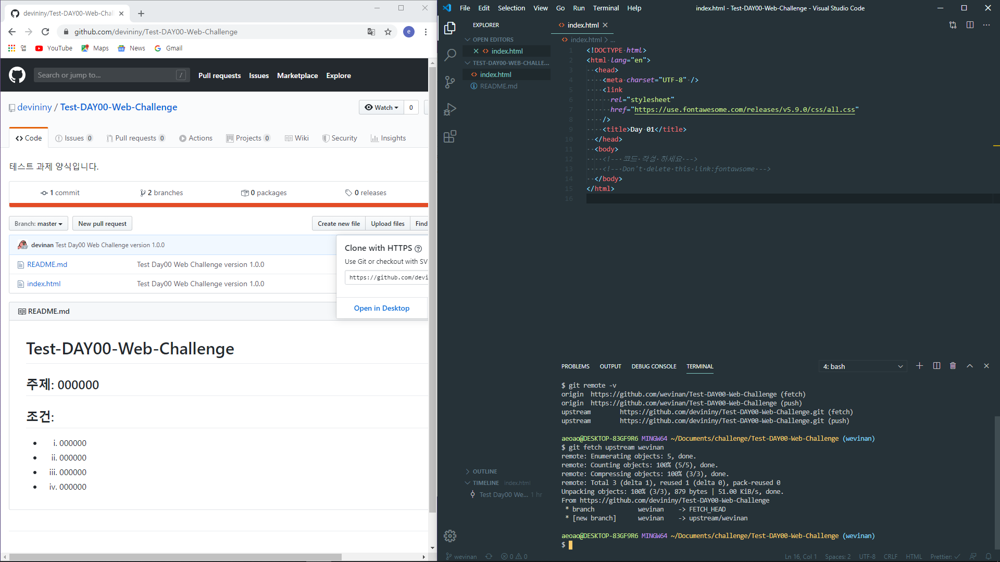

## Devininy Challenge 3단계

3단계는 리뷰 요청을 보낸 후 pull request가 devininy으로 통합(merge)된 이후의 과정을 다룹니다.

**만약** 과제가 **step1까지만 언급**이 되어있다면 3단계는 안하셔도 됩니다.

---

1. merge를 완료했다는 통보를 받으면 브랜치 변경 및 작업 브랜치 삭제(option)한다.
   > 강사에게 승인 후 merge를 완료했다는 통보를 받으면 해당 과제는 완료한 상태가 됩니다.
   >
   > 현재 과제를 완료했기 때문에 과제를 진행한 브랜치를 삭제하고 다음 과제를 위한 새로운 브랜치를 생성해야 한다.

```
git checkout 본인_아이디
git branch -D 삭제할_브랜치이름
ex) git checkout wevinan
ex) git branch -D step1
```

---

2. 통합(merge)한 devininy 저장소와 동기화하기 위해 devininy 저장소 추가(최초 한번만)
   > 계정 브랜치에서 다음 과제를 이어서 진행하기 위해 브랜치를 생성하려고 한다.
   >
   > 그런데 로컬 PC의 현재 상태는 최신 코드가 아니기 때문에 미션을 이어서 진행할 수 없다. 따라서 **devininy에 통합(merge)된 코드와 동기화하는 작업을 진행**해야 한다.

```
git remote add {저장소_별칭} base_저장소_url
ex) git remote add upstream https://github.com/devininy/Test-DAY00-Web-Challenge.git
// 위와 같이 next-step 저장소를 추가한 후 전체 remote 저장소 목록을 본다.
git remote -v
```

- **git remote add** 명령은 최초 1회만 진행하면 된다.

---

3. devininy 저장소에서 자기 브랜치 가져오기(또는 갱신하기)
   > 앞 단계의 `remote add` 명령은 로컬 PC에서 devininy 저장소에 접근할 수 있도록 이름을 부여한 것이다. 앞 단계의 예제는 upstream이라는 이름을 부여했다.
   >
   > 앞 단계에서 devininy 저장소에 이름을 부여했다면 이번 단계는 fetch 명령으로 동기화하고 싶은 devininy 저장소의 브랜치를 가져오기 해야 한다.

```
git fetch upstream {본인_아이디}
ex) git fetch upstream wevinan
```

- fetch 명령을 실행한 후의 상태를 다음과 같다.



> fetch 명령을 실행한 후 `git branch -a` 명령을 실행하면 remotes/upstream/javajigi와 같은 브랜치가 생성된 것을 확인할 수 있다.

---

4. devininy 저장소 브랜치와 동기화하기
   > 현재 상태는 devininy 저장소 브랜치를 가져오기는 했지만 아직까지 로컬 저장소에 최신 버전의 코드가 반영된 것은 아니다.
   >
   > rebase 명령을 실행해 devininy 저장소와 로컬 저장소의 브랜치를 동기화한다.

```
git rebase upstream/본인_아이디
ex) git rebase upstream/wevinan
```

---

5. 새로운 과제를 진행하기 위한 브랜치 생성
   > 지금까지 과정을 통해 새로운 작업을 시작하기 위한 준비 작업을 마쳤다.
   >
   > 다음 단계는 [코드리뷰 요청 1단계](./1.md)의 4번 항목의 checkout 명령으로 새로운 브랜치를 생성한다.

```
git checkout -b 브랜치이름
ex) git checkout -b step2
```

- checkout 명령으로 새로운 브랜치를 생성한 후의 상태는 다음과 같다.

> 다음 단계를 진행하기 위한 모든 준비 작업은 마쳤다.
>
> 지금부터 다음 단계에 도전하면 된다. 다음 단계의 도전이 끝나면 [1단계](./1.md)의 5번 이후의 add, commit, push를 진행하고, 다시 pull request를 보내면 된다.

---
